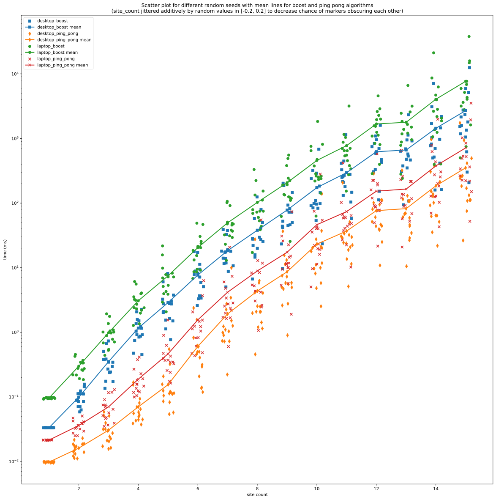

# perf_rcsp

Copyright (C) 2025 Douglas Wayne Potter

This *Performance - Resource Constrained Shortest Path* project explores the performance (latency)
of [boost graphs rscp](https://www.boost.org/doc/libs/1_88_0/libs/graph/doc/r_c_shortest_paths.html) versus a custom implementation, called "ping pong".

## This project is licensed under the GNU Affero General Public License v3.0

See the [LICENSE](./LICENSE) file for details.

### Project Description

This comparison is limited to a dummy VRP problem that are representative of more
complex problems of interest to me (and maybe you). I found that a ~10x speed-up is possible.
More importantly, I've created my own simpler "ping pong" implementation (versus boost graph) where
I can implement problem specific performance improvements.

The "ping pong" implementation tries to avoid some of the indirection and pointer chasing found the boost
implementation by storing all the labels (and states) in contiguous memory for each node.

I would also like to thank the authors of the boost algorithm for providing a correct reference.
That I manage to achieve better performance for instances for a RCSP problem my own choosing is no
surprise. It is almost always easy to achieve better performance given problem and instance specifics and specific
hardware.

### Results Summary

The Google benchmarks defined in [benchmark.cpp](./code/src/benchmark.cpp) were run on my favorite laptop and desktop
computers to produce [benchmark_laptop.json)](./data/benchmark_laptop.json) and
[benchmark_desktop.json)](./data/benchmark_desktop.json), for more details see the commits adding these files.
The Jupyter notebook [visualize_perf.ipynb](./scripts/visualize_perf.ipynb) parses these `json` files and
visualizes them. The plot below is from that notebook. The ~10x speed-up is implied ~10x difference between
"desktop_boost" and "desktop_ping_pong" mean lines (note y log scale).




### Notes

1. I'll use "route generation" for a simple VRP as my dummy problem for RCSP. Some aspects will be naive because those
   are not the aspects I want to explore in this project.
2. I want to be clear that this is not how I would choose solve real life VRPs. There are many VRP specific methods
   and algorithms related to "Adaptive Large Neighborhood Search", "Branch-Price-and-Cut" and others that are
   better suited. Note that an RCSP algorithm can be used a sub-algorithm within some algorithms.

### Development notes:

1. If you add CMake Profile to be built in CLion, you need to go to the vcpkg menu, choose edit and check the added
   CMake profile in "Add Vcpkg integration to existing CMake profiles". Otherwise, CMake won't find the packages
   such as `boost-graph`, `gtest`, etc.
2. Linux commands for CPU frequency scaling:
   ```shell
   cpupower frequency-set --governor performance
   cpupower frequency-set --governor powersave
   cpupower frequency-info -o proc
   ```
3. Setup jupyter-lab via
   ```shell
   pipx install jupyterlab
   pipx inject jupyterlab pandas jupyter-ruff matplotlib
   ```
4. vckpg + cmake:
   ```shell
   vcpkg install
   mkdir release
   cd release
   cmake  -DCMAKE_TOOLCHAIN_FILE=/opt/vcpkg/scripts/buildsystems/vcpkg.cmake -DCMAKE_BUILD_TYPE=Release ..
   make
   ```
